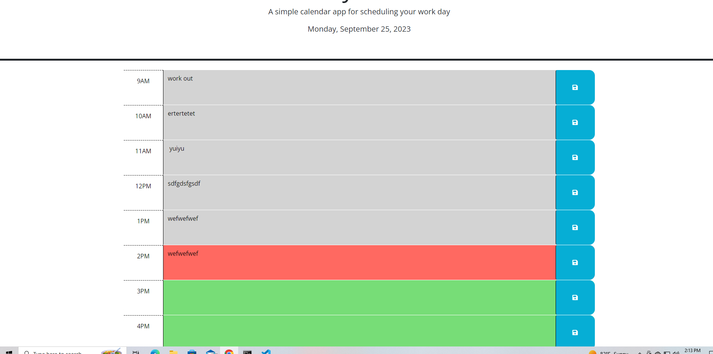

# Work-day-scheduler-Module5

# deployed link

https://gmoney3303.github.io/Work-day-scheduler-Module5/

## Description
Working on this project helped me work on using $ objects and functions also small syntax like .find and .val. Setting the local storage and getting the local storage gave me the most problem but googleing and using the expert learning assistant helped with that.

## usage

## features
this project features the current date along with a 9am to 5PM list that can be filled in that when saved will save to local storage and even when the page refreshes the list will still be there saved